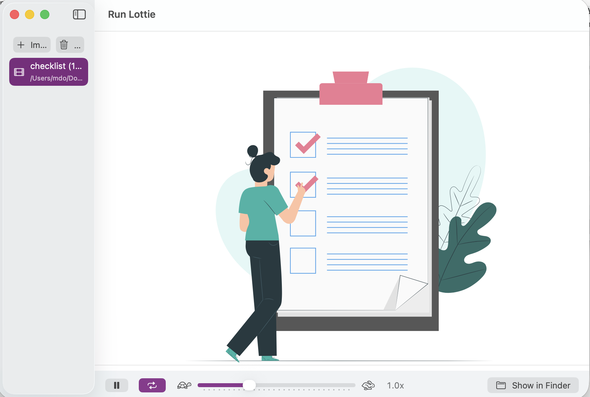

# Run Lottie (macOS)

A lightweight macOS SwiftUI app to preview Lottie animations. Drag & drop `.json` or `.lottie` files into the app, or import them via the file picker, then play the animation with controls for play/pause, loop, and speed.

## Install (No App Store)
- Download prebuilt binaries (no local export needed):
  - [Download DMG](https://raw.githubusercontent.com/mdo91/macos-run-lottie/main/build/export/Run%20Lottie.dmg)
  - [Download ZIP](https://raw.githubusercontent.com/mdo91/macos-run-lottie/main/build/export/Run%20Lottie.zip)
  - [View export folder](https://github.com/mdo91/macos-run-lottie/tree/main/build/export)
- Download either the `.dmg` or `.zip` release artifact.
- `.dmg` install:
  - Open `Run Lottie.dmg`.
  - Drag `Run Lottie.app` to `Applications`.
  - Eject the disk image and launch from Applications.
- `.zip` install:
  - Unzip `Run Lottie.zip`.
  - Move `Run Lottie.app` to `Applications`.
  - Launch the app.
- The distributed app is signed with Developer ID and notarized for Gatekeeper.

## Build Release Artifacts (Developer)
From the project root after archive/export:

```bash
ditto -c -k --keepParent "build/export/Run Lottie.app" "build/export/Run Lottie.zip"
hdiutil create -volname "Run Lottie" -srcfolder "build/dmg-staging" -ov -format UDZO "build/export/Run Lottie.dmg"
```

Current local outputs:
- `build/export/Run Lottie.zip`
- `build/export/Run Lottie.dmg`

## Notarization Notes
- You do not need to keep the notarization submission ID for normal distribution.
- Keep it only for audit/troubleshooting (for example, to fetch notarization logs later).
- If your Apple Developer membership later expires, already shipped signed/notarized builds usually keep running.
- New releases/updates will require an active membership to sign with Developer ID and submit notarization again.

## Features
- Drag & drop support for `.json` and `.lottie` files
- Import via file picker
- Animated playback with:
  - Play/Pause
  - Loop toggle
  - Speed control (0.1x – 3.0x)
- Reveal selected file in Finder
- Error alerts for invalid/non-Lottie JSONs
- Modular SwiftUI architecture with self-contained views

## Requirements
- macOS 13+
- Xcode 15+

## Setup
1. Open the project in Xcode.
2. Add the Lottie Swift Package:
   - File → Add Packages…
   - URL: https://github.com/airbnb/lottie-spm
   - Add the product named `Lottie` to your app target (recommended). Set Embed = Do Not Embed.
   - Alternatively, if you need a dynamic framework, add `LottieDynamic` and set Embed & Sign.
3. Clean build folder (Shift+Cmd+K) and Build (Cmd+B).

If you don’t add the package, the app will compile but show a friendly placeholder in the player area.

## Usage
- Drag & drop `.json` or `.lottie` files into the window, or click Import to choose files.
- Select a file from the sidebar to play it.
- Use the control bar to play/pause, toggle looping, and adjust playback speed.
- Right-click an item in the sidebar to reveal it in Finder.

## Architecture
- SwiftUI-based with a clean separation of concerns:
  - `ContentView`: Composes the app’s main layout and manages shared state.
  - `AnimationSidebarView`: Handles import UI, file listing, and selection.
  - `AnimationPlayerAreaView`: Renders the selected animation and playback controls.
  - `LottiePlayerView`: macOS wrapper (`NSViewRepresentable`) around the Lottie player with a graceful fallback when Lottie isn’t installed.
- Drag & drop and FileImporter feed into a common `handleDrop(_:)` that filters allowed extensions.
- Load errors from the player propagate up via a callback and are displayed with an alert.

## Notes on Lottie compatibility
- Lottie only plays Lottie-formatted JSON files (typically exported from After Effects via Bodymovin). Arbitrary JSON won’t play.
- Not all After Effects features are supported by Lottie; some complex effects or expressions may render differently or not at all.

## Troubleshooting
- Linker error referencing `Lottie-Dynamic.framework`:
  - Remove stale entries from Target → Build Phases → Embed Frameworks and Link Binary With Libraries.
  - Add the correct package product: `Lottie` (static, Do Not Embed) or `LottieDynamic` (Embed & Sign). Do not add both.
  - Reset package caches (File → Packages → Reset Package Caches) and clean build folder.
- If animations don’t play:
  - Confirm the file is a valid Lottie animation (JSON schema with `v`, `assets`, `layers`).
  - Check the alert message for details.

## Roadmap / Potential Future Enhancements
- Scrubbing/seek bar and current time indicator
- Frame-by-frame stepping, start/end frame selection
- Fit/Fill, background color, and pixel grid options
- Snapshot/export to GIF or video
- Recent files persistence with security-scoped bookmarks
- Validation pass on import to pre-filter non-Lottie JSONs
- Support for multiple concurrent players in tabs or windows
- Keyboard shortcuts customization
- Swift Testing tests for drop/import logic

## License
This project is provided as-is for educational/demo purposes.
